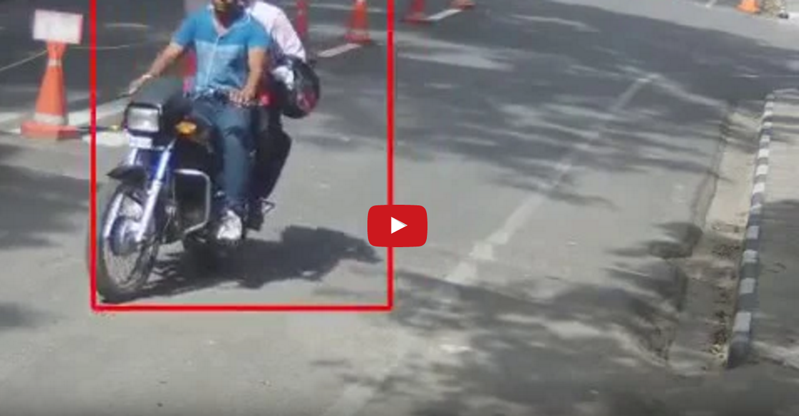

# Automatic Vehicle Classifier for surveillance videos

Our college used to keep records of surveillance videos for security purposes. We thought of utilizing this data to design an Automatic Vehicle Classification system for surveillance videos. Aim was automatically label input surveillance video into pedestrian, two-wheeler, three-wheeler, four-wheeler etc.

</a>

For object detection in video frames, we identified foreground objects. We used bgslibrary for background foreground separation and foreground was separated using basic Opencv operations. We manually labelled the data using [vatic](http://web.mit.edu/vondrick/vatic/) video annotation tool(Soon this dataset will be published). Our dataset consist of images of pedestrians (1323), two-wheelers (906), three-wheelers (81) and four-wheelers (134). We trained classifier ([ovr svm](https://en.wikipedia.org/wiki/Multiclass_classification#One-vs.-rest)) using surf features. We also used features from pretrained deepnet BVLC [GoogleNet](https://github.com/BVLC/caffe/tree/master/models/bvlc_googlenet). As of now, each frame of input video is separately labelled. For detailed results, see [results](results) folder.

Following is the structure of code for usage and contribution:

- [bg-fg-separator](bg-fg-separator) : 
	Contains final script for labelling videos 
	python separator.py <path to input video>
- [classifier](classifier) : 
	Contains classifier and trained model
- [feature-extractor](feature-extractor) : 
	Contains scripts for feature extraction 

## Authors
- [Shubham Agrawal](https://github.com/submagr)
- [Rahul Kumar Wadbude](https://github.com/warahul)
